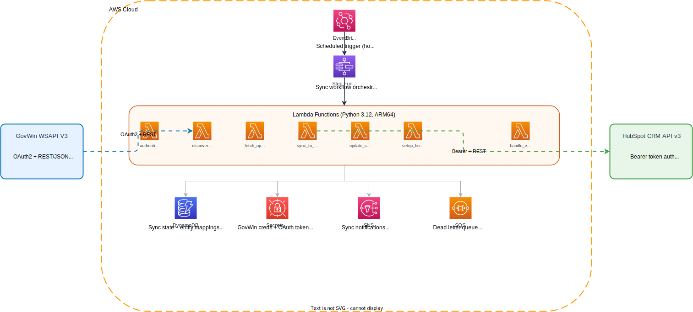
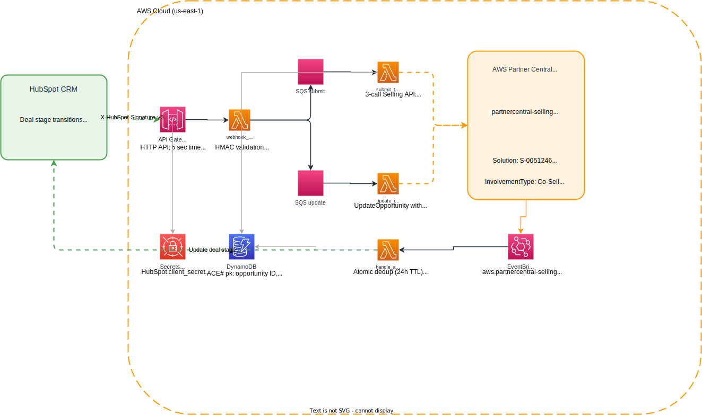

# GovWin to AWS Partner Central, end-to-end and open-source

[](https://github.com/pandora-cloud/govwin-hubspot-integration/actions/workflows/ci.yml)
[](https://github.com/pandora-cloud/govwin-hubspot-integration/actions/workflows/codeql.yml)
[](LICENSE)
[](https://www.python.org/downloads/release/python-3120/)
[](https://developer.hashicorp.com/terraform)

The first fully open-source pipeline from Deltek GovWin IQ to AWS Partner Central, via HubSpot CRM. No paid third-party connector dependencies. Apache-2.0 licensed.

Built and maintained by [Pandora Cloud](https://pandoracloud.net).

## Who this is for (and not for)

**Built for**: federal AWS partners who use HubSpot CRM and have a Deltek GovWin IQ subscription, and who need to submit opportunities into AWS Partner Central's ACE program. Strongest fit if you're a registered AWS Partner with at least one Approved Solution.

**Not built for**: organizations using Salesforce, Pipedrive, Microsoft Dynamics, Zoho, or any other CRM (those adapters are explicitly out of scope; see [CONTRIBUTING.md](CONTRIBUTING.md)). Not built for commercial-only co-sell flows; the project's mapping table is federal-aware (NAICS codes, GovWin opportunity types, federal pipeline stages).

## What This Does

Federal AWS partners use this to mark opportunities in GovWin and have them flow automatically through HubSpot CRM, where the BD team reviews and adds three ACE-required fields, and into AWS Partner Central as ACE-submitted co-sell deals. The integration handles three boundaries the rest of the market makes you stitch together yourself:

1. **GovWin IQ to HubSpot.** Marked opportunities sync into HubSpot every few hours with their agency, contacts, and contract details pre-populated across 30 custom properties.
2. **HubSpot to AWS Partner Central.** When a deal moves to a "Submit to AWS" stage, a HubSpot webhook fires, the integration calls `CreateOpportunity` -> `AssociateOpportunity` -> `StartEngagementFromOpportunityTask` against the AWS Partner Central Selling API, and the engagement is queued for AWS review.
3. **AWS Partner Central back to HubSpot.** EventBridge events on `aws.partnercentral-selling` flow into a handler that updates the HubSpot deal stage based on AWS's review outcome (Approved / Action Required / Rejected / Expired).

Nine of the twelve mandatory ACE fields are auto-populated from GovWin data. Three fields require manual entry by BD in HubSpot before the deal is submission-ready: **Delivery Model**, **AWS Solution**, and **Partner Primary Need from AWS**. This is intentional, and the README calls it out so users do not expect a fully-automated flow.

The sync runs incrementally and respects both GovWin's 4,000 calls/hour cap and the AWS Partner Central 1 write/sec, 10 reads/sec quotas.


## How It Works

### For your BD team

1. **Find an opportunity in GovWin IQ** and click "Add to Web Services Download" on the opportunity detail page.
2. **The integration syncs it to HubSpot** on the next scheduled run (default: every 4 hours). A deal appears in your **Government** pipeline with the opportunity details, agency, and contacts already filled in.
3. **Review the deal in HubSpot**, fill in three ACE fields (Delivery Model, AWS Solution, Partner Primary Need from AWS), and move the stage to **Submit to AWS**.
4. **The submission fires automatically** via HubSpot webhook. The deal moves through the AWS Partner Central review and the HubSpot stage updates as AWS responds.

### Under the hood

The GovWin to HubSpot half (v2.1):



- **EventBridge Scheduler** fires the orchestrator Lambda on a configurable cadence (default: hourly).
- **AWS Lambda (x2)** owns the sync: an orchestrator that does discovery + token refresh + SQS fan-out, and a worker that drains the queue, fetches each opportunity bundle from GovWin, and pushes batches to HubSpot. Concurrency is governed by `reservedConcurrentExecutions`.
- **SQS** carries one message per opportunity batch; partial-batch failures are reported via `ReportBatchItemFailures` so a stuck batch never blocks the rest.
- **DynamoDB** tracks sync cursors, per-opportunity update timestamps, and GovWin-to-HubSpot ID mappings.
- **Secrets Manager** stores GovWin credentials, OAuth tokens, and the HubSpot REST token.
- **SNS** sends email notifications on terminal failures; an SQS dead-letter queue captures messages that exceed the retry budget.

The HubSpot to AWS Partner Central half (new in v2):



- **HubSpot developer-platform app** (private, static auth) registers webhook subscriptions for the deal properties we care about.
- **API Gateway HTTP API** in front of a small Lambda receiver that validates `X-HubSpot-Signature-v3` and routes events into either the submit queue (deal-stage transitions) or the update queue (content-property changes).
- **Two SQS queues with DLQs** decouple webhook delivery from the AWS Partner Central API calls so we never blow HubSpot's 5-second response budget.
- **Three new AWS Lambdas:** `submit_to_ace` runs the three-call submission with resume-from-step idempotency, `update_in_ace` handles UpdateOpportunity with optimistic locking, and `handle_ace_event` consumes EventBridge events from `aws.partnercentral-selling` to mirror AWS-side state changes back into HubSpot.
- **DynamoDB** ACE# pk pattern stores the AWS opportunity ID, ClientToken, engagement task ID, and last-modified date for optimistic locking on subsequent updates.

## How does this compare to other tools?

| | This project (v2) | This project (v1) | Salesforce Connector |
|---|---|---|---|
| GovWin to HubSpot | Yes | Yes | No |
| HubSpot to AWS Partner Central | Yes (direct API) | No (out of scope in v1) | No |
| Open source | Yes (Apache-2.0) | Yes (Apache-2.0) | No |
| Cost | Free | Free | $$/seat/month |
| Federal-aware (NAICS, GovWin status) | Yes | Yes | No |

## ACE-Ready Deals

The integration auto-populates the majority of mandatory fields required by AWS Partner Central (ACE). After a deal syncs to HubSpot, your team only needs to fill in three fields before submitting to AWS Partner Central.

| # | ACE Mandatory Field | HubSpot Property | Source | Auto-populated |
|---|---|---|---|---|
| 1 | Project Title | `dealname` | GovWin `title` | Yes |
| 2 | Project Description | `description` | GovWin `description` (sanitized) | Yes |
| 3 | Customer Company Name | Associated Company `name` | GovWin `govEntity.title` | Yes |
| 4 | Industry Vertical | `govwin_industry` | NAICS code mapped to AWS industry | Yes |
| 5 | Country | `govwin_country` | GovWin `country` | Yes |
| 6 | Target Close Date | `closedate` | GovWin `pAwardDateTo` or `responseDate` | Yes |
| 7 | Expected AWS Monthly Revenue | `amount` | GovWin `oppValue` x 1000 | Yes |
| 8 | Opportunity Type | `govwin_ace_opportunity_type` | Default: "Net New Business" | Yes |
| 9 | Stage | `dealstage` | Mapped from GovWin `status` | Yes |
| 10 | Delivery Model | `govwin_ace_delivery_model` | -- | **Manual** |
| 11 | Solution Offered | `govwin_ace_solution` | -- | **Manual** |
| 12 | Partner Primary Need from AWS | `govwin_ace_partner_need` | -- | **Manual** |

For the full end-to-end ACE submission workflow, see the [ACE Integration Guide](docs/ace-integration.md).

## Prerequisites

- [ ] **Deltek GovWin IQ** subscription with WSAPI V3 access (Client ID, Client Secret, username, password)
- [ ] **HubSpot** account (Professional or Enterprise) with a private-app token plus a separate developer-platform app for webhook delivery (created via `hs project create`, see [Deployment Guide](docs/deployment-guide.md))
- [ ] **AWS Partner Central account** in good standing, with at least one **Approved Solution** registered (run `aws partnercentral-selling list-solutions --catalog AWS` to confirm). Marketplace seller linking is **not** required for this project.
- [ ] **AWS account** in `us-east-1` (the Partner Central Selling API is region-locked). **No AWS administrator access is required at any step.** The project ships a `terraform/bootstrap/` module that creates a least-privilege deployer role; a one-time bootstrap operator runs that module with a scoped policy (`terraform/bootstrap/policies/bootstrap-operator.json`) and is deleted afterwards. See [SECURITY.md](SECURITY.md#iam-model) for the full IAM story.
- [ ] **Terraform** >= 1.11 ([install guide](https://developer.hashicorp.com/terraform/tutorials/aws-get-started/install-cli))
- [ ] **AWS CLI** configured with credentials (`aws configure`)
- [ ] **Python** >= 3.12 for building the Lambda layer
- [ ] **uv** for the lockfile workflow (`pip install uv` or `brew install uv`); `make package` reads the committed `requirements.lock`, and `make lock` regenerates it from `pyproject.toml` via `uv export`
- [ ] **HubSpot CLI** (`npm install -g @hubspot/cli`) for the developer-platform app
- [ ] (Optional) **Docker** for local testing with LocalStack (the project pins `localstack/localstack:3.8` so contributors don't need a paid LocalStack license)

## Quick Start

### 1. Clone the repository

```bash
git clone https://github.com/pandora-cloud/govwin-hubspot-integration.git
cd govwin-hubspot-integration
```

### 2. Create a HubSpot API token

Log in to HubSpot as a Super Admin and go to **Settings > Integrations > Service Keys**. Create a key named "GovWin Integration" with these scopes:

- `crm.objects.deals.read` / `crm.objects.deals.write`
- `crm.objects.companies.read` / `crm.objects.companies.write`
- `crm.objects.contacts.read` / `crm.objects.contacts.write`
- `crm.schemas.deals.read` / `crm.schemas.deals.write`
- `crm.schemas.companies.read` / `crm.schemas.companies.write`
- `crm.schemas.contacts.read` / `crm.schemas.contacts.write`

Copy the token (starts with `pat-na1-` or `pat-na2-`). If Service Keys are not available in your HubSpot account, create a Private App instead under **Settings > Integrations > Private Apps** with the same scopes. See the [Deployment Guide](docs/deployment-guide.md#step-2-create-hubspot-api-token) for details on both options.

### 3. Get GovWin API credentials

You need four values: Client ID, Client Secret, username (email), and password. Your GovWin administrator provisions API access under **Admin > Web Service API** in the GovWin IQ portal. The username is the email address of a GovWin user account - a dedicated API user is recommended for production. See the [Deployment Guide](docs/deployment-guide.md#step-3-get-govwin-api-credentials) for step-by-step instructions and security considerations.

### 4. Configure Terraform variables

```bash
cp terraform/terraform.tfvars.example terraform/terraform.tfvars
```

Edit `terraform/terraform.tfvars` with your credentials and preferred settings:

```hcl
# Required
govwin_client_id          = "your-client-id"
govwin_client_secret      = "your-client-secret"
govwin_username           = "your-email@company.com"
govwin_password           = "your-password"
hubspot_private_app_token = "pat-na1-xxxxxxxx-xxxx-xxxx-xxxx-xxxxxxxxxxxx"

# Optional
aws_region         = "us-east-1"
sync_schedule      = "rate(4 hours)"
notification_email = "alerts@company.com"
```

This file is gitignored and will not be committed.

### 5. Build and deploy

```bash
# Package Python dependencies into a Lambda layer (cross-compiled for ARM64)
make package

# Deploy infrastructure
cd terraform
terraform init
terraform plan    # Review what will be created
terraform apply   # Deploy (type "yes" when prompted)
```

Terraform creates all AWS resources, stores credentials in Secrets Manager, creates the HubSpot custom properties, and schedules the first sync. The HubSpot pipeline named **"Government"** must already exist in your account (see [Deployment Guide](docs/deployment-guide.md#step-1-prepare-hubspot)). Stage labels must match those in `src/hubspot/properties.py` (`GOVWIN_STATUS_TO_STAGE`).

### 6. Mark opportunities and verify

In GovWin IQ, open any opportunity and click **"Add to Web Services Download"**. The next scheduled sync (or a manual trigger) picks it up and creates the deal in HubSpot.

To trigger a sync immediately, invoke the orchestrator Lambda directly:

```bash
aws lambda invoke --function-name govwin-hubspot-prod-govwin-orchestrator \
  --region us-east-1 /tmp/orch.json && cat /tmp/orch.json
```

The orchestrator does discovery + token refresh + SQS fan-out; the worker Lambda then drains the queue. v2.1 replaced the previous Step Functions chain with this Lambda + SQS pattern (see [`docs/architecture.md`](docs/architecture.md) for the why).

Verify in HubSpot under **Settings > Objects > Deals > Pipelines** that the "Government" pipeline shows the synced deals.

## Configuration

All configuration is managed through Terraform variables in `terraform/terraform.tfvars`.

| Variable | Default | Description |
|---|---|---|
| `govwin_client_id` | (required) | GovWin WSAPI client ID |
| `govwin_client_secret` | (required) | GovWin WSAPI client secret |
| `govwin_username` | (required) | GovWin user email for API access |
| `govwin_password` | (required) | GovWin user password for API access |
| `hubspot_private_app_token` | (required) | HubSpot Service Key or Private App access token |
| `aws_profile` | `default` | AWS CLI profile name for authentication |
| `aws_region` | `us-east-1` | AWS region for deployment |
| `environment` | `prod` | Environment name: `prod`, `staging`, or `dev` |
| `project_name` | `govwin-hubspot` | Project name prefix for resource naming |
| `sync_schedule` | `rate(1 hour)` | EventBridge schedule expression for sync frequency |
| `ace_partner_company_name` | `Partner Company` (placeholder) | Your company's legal name. Surfaced to AWS Partner Central as `ExpectedCustomerSpend.TargetCompany` on every co-sell submission. **Required for production deployments** — the placeholder is harmless in Sandbox but should not appear on real submissions. |
| `ace_default_solution_id` | (required for ACE) | AWS Partner Central Solution ID (e.g. `S-1234567`). Discover via `aws partnercentral-selling list-solutions --catalog AWS --region us-east-1`. |
| `ace_trigger_stages` | `submit_to_aws,submitted_to_aws` | Comma-separated HubSpot deal-stage internal IDs that trigger an ACE submission. Production deployments must override this with the numeric stage IDs from the HubSpot pipeline editor (e.g. `3590200042`). See [docs/deployment-guide.md](docs/deployment-guide.md#9bi-find-your-hubspot-pipeline-stage-internal-ids-ace_trigger_stages). |
| `govwin_opp_types` | `ALL` | Opportunity types to sync: `OPP`, `BID`, `TNS`, `FBO`, `OPN`, `TOP`, or `ALL` |
| `govwin_market` | `""` (both) | Market filter: `Federal`, `SLED`, or `""` for both |
| `govwin_marked_version` | `2.2` | Marked-for-download filter: `2.2` (Web Services), `2` (Deltek CRM), `""` (disabled) |
| `govwin_saved_search_id` | `""` | GovWin saved search ID to filter opportunities |
| `govwin_bookmarked_only` | `false` | Only sync bookmarked opportunities |
| `initial_lookback_days` | `365` | Days to look back on first sync |
| `max_concurrency` | `2` | Worker `reservedConcurrentExecutions` (1-5; bound by GovWin 4k/hour budget) |
| `batch_size` | `10` | Opportunities per SQS message (1-25) |
| `enable_notifications` | `true` | Enable SNS email notifications for sync events |
| `notification_email` | `""` | Email address for sync notifications |
| `log_retention_days` | `30` | CloudWatch log retention in days |
| `tags` | `{}` | Additional tags applied to all resources |

## Opportunity Filtering

By default, only opportunities your BD team explicitly marks in GovWin IQ are synced. This keeps your HubSpot pipeline focused on opportunities that matter.

| Mode | Variable | How It Works |
|---|---|---|
| **Marked for Sync** (default) | `govwin_marked_version = "2.2"` | Only syncs opps where your team clicked "Add to Web Services Download" in GovWin IQ |
| Saved Search | `govwin_saved_search_id = "12345"` | Syncs opps matching a saved search you configured in GovWin |
| Bookmarked Only | `govwin_bookmarked_only = true` | Syncs opps your team bookmarked in GovWin |

These modes can be combined. For example, setting both `govwin_marked_version = "2.2"` and `govwin_bookmarked_only = true` syncs only bookmarked opps that are also marked for download.

To disable filtering entirely and sync all opportunities:

```hcl
govwin_marked_version = ""
```

This is not recommended for production - GovWin contains hundreds of thousands of opportunities, and syncing all of them would overwhelm your HubSpot pipeline.

## Data Mapping

The integration creates 30 custom deal properties, 5 company properties, and 3 contact properties in HubSpot, all under the `govwin_` prefix. Deals are placed in your existing **"Government"** pipeline, with GovWin statuses mapped to its stage labels.

### Key field mappings

| GovWin Field | HubSpot Property | Transform |
|---|---|---|
| `title` | `dealname` | Direct |
| `oppValue` | `amount` | Multiplied by 1,000 (GovWin stores in thousands) |
| `description` | `description` | HTML stripped, truncated to 65,536 chars |
| `pAwardDateTo` / `responseDate` | `closedate` | Converted to HubSpot epoch milliseconds |
| `id` (e.g., OPP12345) | `govwin_opp_id` | Deduplication key |
| `status` | Deal stage | Mapped to pipeline stages (Pre-RFP, RFP Released, etc.) |
| `govEntity.title` | Associated Company `name` | Creates/updates HubSpot company |
| `primaryNAICS` | `govwin_industry` | NAICS code mapped to AWS ACE industry values |
| `solicitationNumber` | `govwin_solicitation_number` | Direct |
| `country` | `govwin_country` | USA or CAN |
| `competitionTypes[0].title` | `govwin_competition_type` | Direct |
| `contractTypes[0].title` | `govwin_contract_type` | Direct |

### Pipeline stages

GovWin statuses map to stage labels in your existing **"Government"** pipeline. The labels below must exist in that pipeline; adjust `GOVWIN_STATUS_TO_STAGE` in `src/hubspot/properties.py` if yours differ.

| GovWin Status | HubSpot Stage Label |
|---|---|
| Pre-RFP, Pre-Solicitation | Opportunity Identified |
| RFP Released, RFP, Solicitation | Reviewing Requirements |
| Proposal Submitted | Preparing Response |
| Under Evaluation, Evaluation | Submitted |
| Awarded, Award | Closed Won |
| Cancelled, Closed, Lost | Closed Lost |
| Declined | Declined |

### Associations

Deals are linked to their government agency (Company) and agency contacts (Contacts). Companies and contacts are deduplicated across opportunities - if three deals reference GSA, a single GSA company record is shared.

For the complete mapping of all 38 properties, NAICS-to-industry codes, and association logic, see the [Field Mapping Reference](docs/field-mapping.md).

## Pre-deployment Testing

Before deploying to AWS, you can validate credentials and preview the sync locally.

```bash
# Copy and fill in your credentials
cp .env.example .env

# Validate connectivity to GovWin, HubSpot, and AWS
make validate

# Preview what would sync without writing to HubSpot (fetches up to 5 opps)
make dry-run
```

For testing against real AWS services locally using Docker and LocalStack:

```bash
make local-up       # Start LocalStack with DynamoDB, Secrets Manager, SNS, SQS
make local-test     # Run integration tests against LocalStack
make local-down     # Stop and clean up
```

The integration suite (`tests/integration/`) exercises the DynamoDB state manager and Secrets Manager paths against the live LocalStack endpoint. It auto-skips when `AWS_ENDPOINT_URL` is not set, so `make test` and CI stay hermetic.

## Project Structure

```
src/
  config.py                  # Configuration from environment variables
  models.py                  # Pydantic models for GovWin and HubSpot data
  govwin/
    auth.py                  # OAuth2 token acquire/refresh via Secrets Manager
    client.py                # GovWin WSAPI V3 client (all endpoints)
    rate_limiter.py          # Token bucket rate limiter (4,000/hr)
  hubspot/
    client.py                # HubSpot CRM API client (batch upsert, associations)
    properties.py            # Custom property and pipeline definitions
    rate_limiter.py          # Sliding window rate limiter (100/10s)
  sync/
    mapper.py                # GovWin-to-HubSpot field transformation, NAICS mapping
    state.py                 # DynamoDB state management (sync cursors, ID mappings)
    dedup.py                 # Change detection via updateDate comparison
    orchestrator.py          # High-level sync coordination
  lambdas/
    govwin_orchestrator.py    # EventBridge Scheduler -> discovery + token refresh + SQS fan-out
    govwin_worker.py          # SQS -> per-batch fetch + HubSpot sync (replaces v1 fetch + sync chain)
    setup_hubspot.py          # One-time property/pipeline creation
    setup_hubspot_webhooks.py # One-time webhook subscription registration
    hubspot_webhook_receiver.py # API Gateway -> validate signature -> SQS routing
    submit_to_ace.py          # SQS -> three-call ACE submission with resume-from-step idempotency
    update_in_ace.py          # SQS -> UpdateOpportunity with optimistic locking
    handle_ace_event.py       # EventBridge -> mirror AWS state changes to HubSpot
terraform/
  main.tf                    # Root module wiring
  variables.tf               # All configurable inputs
  outputs.tf                 # Terraform outputs (ARNs, URLs)
  provider.tf                # AWS provider configuration
  modules/
    lambda/                  # Shared Lambda execution role + dependency layer + source archive
    govwin_sync/             # GovWin orchestrator + worker, SQS fan-out, EventBridge Scheduler
    ace/                     # ACE submission half (webhook receiver, submit/update, EventBridge handler)
    dynamodb/                # DynamoDB tables
    secrets/                 # Secrets Manager secrets
    monitoring/              # SNS, SQS, CloudWatch
tests/
  unit/                      # 92 unit tests (17 test files, hermetic)
  integration/               # LocalStack integration tests (skipped without AWS_ENDPOINT_URL)
  conftest.py                # Shared pytest fixtures
scripts/
  validate.py                # Pre-deployment credential validation
  dry_run.py                 # Preview sync without writing to HubSpot
  localstack-init.sh         # LocalStack resource initialization
docs/
  architecture.md            # System design and AWS resource details
  field-mapping.md           # Complete GovWin-to-HubSpot field mapping
  deployment-guide.md        # Step-by-step deployment instructions
  ace-integration.md         # ACE submission workflow
  testing-in-your-account.md # Full test pyramid + sandbox smoke + production rollout reference
  operations.md              # Alarms, stuck-deal recovery, fault-injection, DR
  phase4-runbook.md          # Phase 4.1 sandbox + Phase 4.2 production smoke runbook
  diagrams/                  # Architecture and pipeline diagrams (SVG + drawio)
```

## Documentation

- [Architecture Overview](docs/architecture.md) - System design, sync flow, DynamoDB schema, rate limiting strategy
- [Field Mapping Reference](docs/field-mapping.md) - All 38 mapped properties, NAICS-to-industry codes, pipeline stages, associations
- [Deployment Guide](docs/deployment-guide.md) - Full deployment walkthrough, credential setup, troubleshooting
- [ACE Integration Guide](docs/ace-integration.md) - End-to-end workflow for submitting deals to AWS Partner Central
- [Testing in your AWS account](docs/testing-in-your-account.md) - The full test pyramid (unit -> static -> LocalStack -> validate -> dry-run -> sandbox smoke -> production smoke), the 11-scenario smoke matrix, MFA / Sandbox-Solution gotchas, and the criteria for flipping to the AWS catalog
- [Operations](docs/operations.md) - CloudWatch alarms, stuck-deal recovery, fault-injection, DR
- [Phase 4 runbook](docs/phase4-runbook.md) - Sandbox bring-up + production cutover

## Security

- All API credentials (GovWin Client ID/Secret, username/password, HubSpot token) are stored in AWS Secrets Manager and never passed as plaintext environment variables.
- GovWin OAuth tokens are cached in Secrets Manager and refreshed automatically before expiry. The refresh flow avoids the 5-attempt lockout on the password grant.
- Lambda execution roles follow least-privilege principles - each function can only access the specific Secrets Manager keys and DynamoDB tables it needs.
- `terraform.tfvars` and `.env` are gitignored. Secret detection runs in the GitLab CI pipeline to catch accidental credential commits.
- DynamoDB tables use encryption at rest (AWS-managed keys). Secrets Manager encrypts all stored values with KMS.
- No VPC is required since the integration only calls external APIs, reducing attack surface and eliminating NAT Gateway costs.

## Estimated Cost

Running this integration on AWS costs approximately **$6/month** at moderate volume (around 1,000 opportunities). The main cost drivers are Lambda invocations, DynamoDB reads/writes, and Secrets Manager API calls. EventBridge Scheduler, SNS, and SQS all fall within their free tiers at this scale. Lambda runs on ARM64 (Graviton2) for a 20% cost reduction over x86.

## Development

```bash
make install-dev    # Install development dependencies (ruff, mypy, pytest, etc.)
make test           # Run 293 unit tests (no Docker required)
make local-up       # Start LocalStack 3.8 (community edition; no auth token needed)
make local-test     # Run 6 LocalStack integration tests
make local-down     # Tear down LocalStack
make lint           # Check code with ruff
make format         # Auto-format code with ruff
make typecheck      # Run mypy type checking
make package        # Build the ARM64 Lambda layer zip (requires uv-managed requirements.lock)
make lock           # Regenerate requirements.lock from pyproject.toml via uv
```

Optional but recommended:

```bash
pip install pre-commit && pre-commit install   # Local pre-commit hooks (ruff, mypy, terraform fmt, gitleaks)
PYTHONPATH=. .venv/bin/python scripts/verify_fips.py   # Confirm every AWS service resolves to a FIPS endpoint
```

## FAQ

**Why two HubSpot apps (private app + developer-platform app)?**
HubSpot's webhook signing (`X-HubSpot-Signature-v3`) requires a `clientSecret` that only developer-platform apps issue; private apps have no client secret. Developer-platform apps cannot expose static REST tokens, so calls back into HubSpot still need the private app. Both are managed by the deployer in the same HubSpot account.

**Why DynamoDB for sync state and not S3-with-git or RDS?**
Pay-per-request DynamoDB is the right shape for key-value sync tracking: predictable cost at our scale, sub-10ms reads, native conditional writes for idempotent ClientToken reservation, native TTL for the EventBridge dedup window. RDS would add a VPC requirement; S3 would force eventual consistency we don't want for the dedup path.

**Why us-east-1 only?**
The `partnercentral-selling` API is exposed only in `us-east-1`. The rest of the integration (Lambdas, DynamoDB, SQS, etc.) is region-flexible via the `aws_region` Terraform variable, but the boto3 client for `partnercentral-selling` is hard-pinned to `us-east-1` in `src/aws_clients.py`. GovCloud (`us-gov-west-1`) support is on the roadmap pending AWS exposing the API there.

**Why Python and not TypeScript or Go?**
AWS Lambda's Python runtime has the smallest cold-start surface for this workload, the federal AWS partner ecosystem is overwhelmingly Python on the data-pipeline side, and the dependency surface is small enough that staying single-language keeps maintenance simple. We're not changing this.

**Why Apache-2.0 and not MIT?**
Apache-2.0 includes an explicit patent grant from contributors. For a project that touches federal contracting workflows, that grant is meaningful. AWS's open-source amplification programs also prefer Apache-2.0 over MIT.

**What's the difference between `ace_catalog = "Sandbox"` and `"AWS"`?**
Sandbox is AWS's safe-to-test catalog: opportunities you create are not visible to AWS reviewers and don't count against any partner reporting. The IAM policy gates this with a `partnercentral:Catalog: Sandbox` condition so you cannot accidentally write to production. Flip to `"AWS"` only after the sandbox smoke matrix is green and you've set `ace_partner_company_name` to your real legal company name. See [docs/testing-in-your-account.md](docs/testing-in-your-account.md#8-criteria-for-flipping-ace_catalog--aws).

**What does the AWS bill look like?**
About $6/month at ~1,000 opportunities and ~10 ACE submissions per month. Lambda invocations + DynamoDB + Secrets Manager dominate; everything else sits in free-tier territory. Lambda runs on ARM64 (Graviton2). See "Estimated Cost" above and [docs/testing-in-your-account.md](docs/testing-in-your-account.md#cost-expectations).

**What if my organization is in GovCloud?**
Today this won't work end-to-end because AWS does not expose `partnercentral-selling` in GovCloud regions. The GovWin -> HubSpot half could run in GovCloud, but the AWS Partner Central submission half cannot until AWS adds the endpoint. We'll ship FedRAMP-Moderate-aligned operating instructions as soon as that's available; see [ROADMAP.md](ROADMAP.md).

**Will you add a Salesforce / Pipedrive / Dynamics adapter?**
No. The project's identity is the GovWin -> HubSpot -> AWS Partner Central triad. Forks with adapters for other CRMs are welcome but won't be merged upstream. See [CONTRIBUTING.md](CONTRIBUTING.md#what-we-will-likely-not-merge).

**Where do I report security issues?**
[GitHub private security advisories](https://github.com/pandora-cloud/govwin-hubspot-integration/security/advisories/new) or email <pc@pandoracloud.net> (PGP key in [.well-known/security/](.well-known/security/)). Do not open a public issue. SLAs in [SECURITY.md](SECURITY.md).

## License

Apache License, Version 2.0. Copyright 2026 [Pandora Cloud](https://pandoracloud.net). See [LICENSE](LICENSE) for the full text and the patent grant terms.
